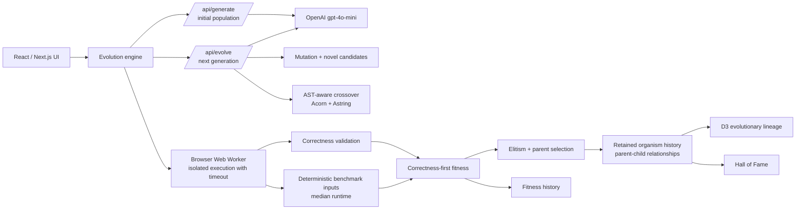

# GENESIS

### A Darwinian Code Evolution Engine

Most AI coding tools stop after generating code. GENESIS starts there.

Rather than requesting one answer from a model, GENESIS creates a population of executable programs, evaluates them, and evolves subsequent generations through selection, mutation, AST-aware crossover, novelty, and elitism. Every retained program has inspectable code, measurable fitness, and traceable ancestry.

Built for **OpenAI Build Week 2026**.

## Why GENESIS

Experienced engineers improve software through iteration: write a version, test it, benchmark it, preserve what works, and combine useful ideas. GENESIS applies that loop to code generation.

OpenAI `gpt-4o-mini` introduces variation through mutations and novel candidates. The evolution engine—not the model alone—decides what survives.

## What it does

- Creates a population of JavaScript functions for a selected algorithmic task.
- Evaluates every candidate in isolated browser execution with timeout protection.
- Uses correctness-first fitness: an incorrect program cannot outrank a fully correct one through speed alone.
- Benchmarks fully correct candidates on identical deterministic inputs and reports median runtime.
- Preserves elite candidates, creates LLM mutations and novel candidates, and performs AST-aware crossover between compatible parent programs.
- Retains full organism history, real parent IDs, Hall of Fame entries, and an interactive evolutionary-lineage graph.
- Lets you inspect a candidate’s source, correctness, benchmark status, median runtime, test results, and ancestry.

## Architecture



## Evolution loop

1. **Initialize** — Generate an initial population for the selected problem.
2. **Evaluate** — Execute each candidate against functional tests in a browser worker. Mutable benchmark inputs are cloned for each execution.
3. **Benchmark** — Candidates that pass every correctness test receive the same deterministic performance cases. GENESIS records median runtime and verification status.
4. **Select** — Sort by correctness-first fitness and preserve elites.
5. **Vary** — Fill the remaining population with mutually exclusive crossover, mutation, or novel routes. At least 10% of the operation probability is reserved for novel candidates to preserve diversity.
6. **Record** — Store every organism instance, parent relationship, fitness result, operation type, and Hall of Fame entry.

Average fitness can temporarily decrease because GENESIS deliberately explores new variants. Elitism and the Hall of Fame retain high-fitness discoveries while the population keeps searching.

## Fitness model

Correctness dominates performance:

```text
if correctness < 1.0: fitness = correctness
if correctness = 1.0: fitness = 1.0 + 0.2 × performanceScore
```

This means a fully correct but slower candidate always ranks above an incomplete candidate, regardless of speed.

## Interactive evidence

The application is designed to make its claims visible:

- **Evolutionary Lineage:** Every node is a retained executable program; edges are stored parent-child relationships.
- **Node types:** 👑 elite, 🧬 crossover, ⚡ mutation, ✨ novel.
- **Organism Inspector:** Shows source code, correctness, verified benchmark status, median runtime, test results, and lineage selection.
- **Hall of Fame:** Keeps the strongest verified discoveries across the entire run, not only the final generation.
- **Evolution Log:** Reports generation operation counts and fitness statistics.

## Tech stack

- Next.js 16 + React 19
- OpenAI API (`gpt-4o-mini` at runtime)
- Acorn + Astring for AST-aware crossover
- Browser Web Workers for candidate execution
- D3 for lineage visualization
- Framer Motion and CSS Modules for the interface

## Run locally

### Prerequisites

- Node.js 20+
- An OpenAI API key with available API billing/quota

### Setup

```bash
git clone https://github.com/94136nikitasharma/genesis-darwinian-code-evolution.git
cd genesis-darwinian-code-evolution
npm install
```

Create `.env.local`:

```bash
OPENAI_API_KEY=your_key_here
```

Run the development server:

```bash
npm run dev
```

Then open [http://localhost:3000](http://localhost:3000).

### Verify the build

```bash
npm run lint
npm run build
```

## How I collaborated with Codex and GPT-5.6 Terra

GENESIS was built iteratively with Codex using **GPT-5.6 Terra** as an engineering collaborator. I set the product direction: preserve the existing architecture, prioritize Build Week proof over production features, and make every visible claim defensible in the demo.

Codex accelerated the work in several concrete phases:

1. **Architecture review** — Mapped the React state flow, API routes, browser worker, evolution loop, fitness calculation, AST crossover, graph, Hall of Fame, and export flow before changes were made.
2. **Incremental engineering** — Helped implement and verify retained genealogy, mutually exclusive evolution routing, deterministic shared benchmark inputs, cloned mutable inputs, correctness-first fitness, model-copy consistency, and pause/resume stability.
3. **Debugging and verification** — Diagnosed API configuration versus quota issues without exposing credentials, ran live evolution sessions, checked 5-, 20-, and 50-generation behavior, and challenged claims about fitness, crossover, lineage, and benchmark fairness.
4. **Release preparation** — Helped clean the repository, document the architecture, prepare demo evidence, and refine the story around what GENESIS can honestly prove.

The product uses **gpt-4o-mini at runtime** for mutation and novel-candidate generation. GPT-5.6 Terra was used through Codex during the development, review, debugging, and verification process—not as a hidden runtime dependency.

## Important execution note

Candidate code runs in an **isolated browser execution context with timeout protection**. It is intended to protect the interactive demo from runaway code; it is not presented as a security boundary for untrusted production workloads.
